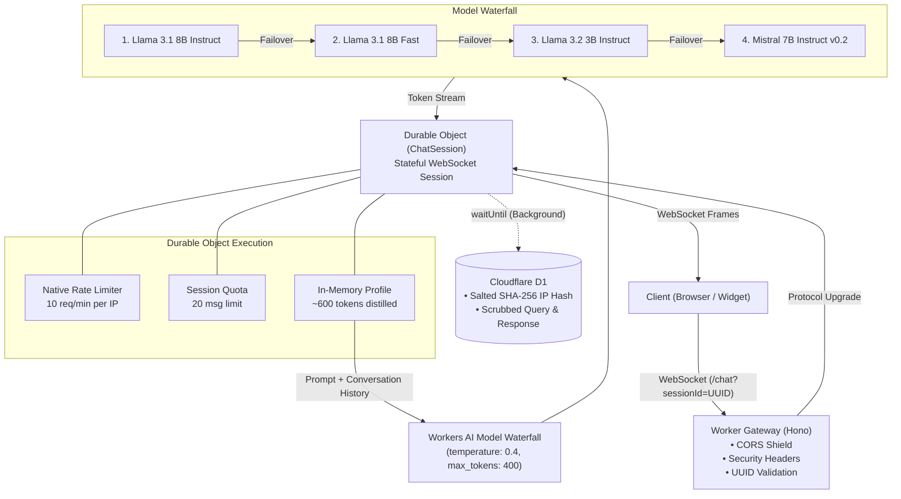

# Cloudflare Workers AI Digital Twin

A conversational edge service deployed on Cloudflare Workers. Serves as a digital twin and interactive portfolio API.

Built on Cloudflare Workers primitives: WebSocket streaming via Durable Objects, direct context grounding, and edge inference via Workers AI with fallback handling.

## Architecture



```text
Client (Browser / Widget)
   |
   |  WebSocket (/chat?sessionId=<uuid>)
   v
Worker Gateway (CORS, security headers, input validation)
   |
   v
Durable Object (ChatSession)
   |-- Rate Limiting: 10 req/min per IP (native Cloudflare limiter)
   |-- Session Quota: 20 messages per session
   |-- Context: In-memory structured profile (~600 tokens)
   |-- Model Fallback: Llama 3.1 8B -> Llama 3.1 8B Fast -> Llama 3.2 3B -> Mistral 7B
   `-- Audit Logging: Salted SHA-256 IP hash and sanitized queries in D1
```

## Engineering Notes: Why We Dropped Vector RAG

The original prototype ran classic RAG: chunk `profile.json`, compute embeddings via BGE (`bge-small-en-v1.5`), store in Vectorize, and retrieve `topK: 3` per query.

We ripped that out for two reasons:

1. **Retrieval drops facts on small documents.**
   Cosine similarity over 3 chunks regularly misses relevant data (e.g., education or specific project history). When an 8B model doesn't see facts in its prompt, it guesses based on name associations. That caused hallucinations.
2. **Double inference burns quota and adds latency.**
   Querying Vectorize required running an embedding inference *plus* the LLM generation on every single message. That consumed 2x the daily Workers AI Neurons and added 200ms of edge latency for zero tangible benefit.

A distilled resume fits into ~600 tokens. Modern context windows handle this with room to spare. Injecting the full profile directly into the system prompt gives 100% factual accuracy, zero retrieval misses, lower TTFT, and half the neuron burn.

The Vectorize setup script (`scripts/setup-profile-vectors.js`) and `/sync` route are kept in the repo for reference if scaling to larger document sets.

## Features

- **Isolated Sessions:** Durable Objects manage individual WebSocket lifecycles. Storage alarms purge inactive sessions after 24 hours.
- **Controlled Generation:** System prompt includes few-shot turns to anchor tone, dry wit, and strict boundary rules. Inference is pinned at `temperature: 0.4`.
- **Model Waterfall:** Automatically falls back across 4 models if the primary instance hits GPU queues or cold starts.
- **Abuse Protections:** Sliding window rate limiting, 500-char input validation, and message caps.
- **Privacy:** Query logs are scrubbed for email addresses and IPs are one-way hashed before writing to D1. No PII is committed to git.

## Setup

### Prerequisites
- Node.js 18+
- Cloudflare account with Workers, Workers AI, and D1 enabled

### Install
```bash
npm install
```
Creates a local `profile.json` from `profile.example.json` if missing.

### Configure
Fill out `profile.json` with your data. This file is gitignored.

### Test
```bash
npm test
```

### Dev
```bash
npm run dev
```

### Deploy
```bash
npm run deploy
```